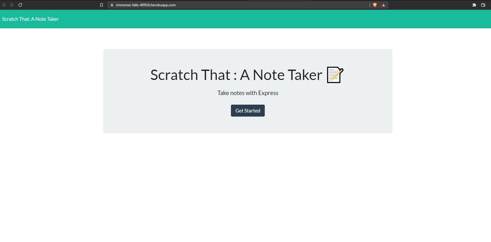
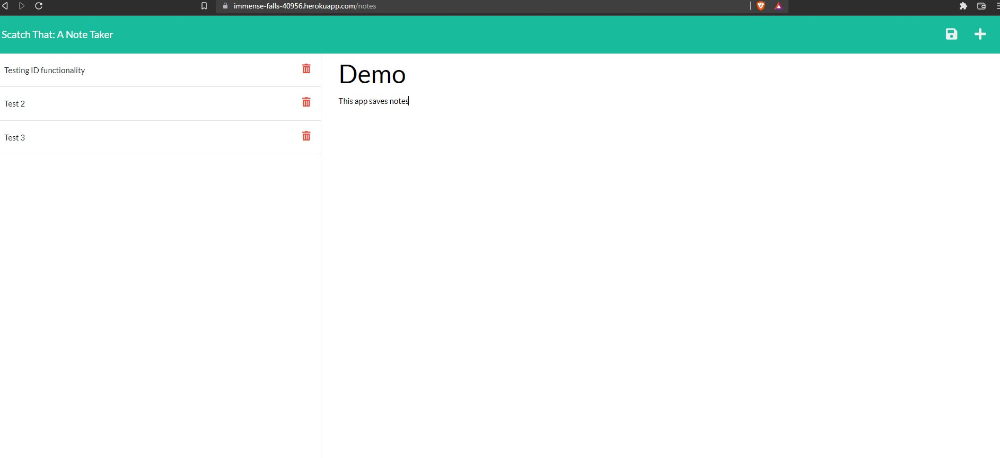
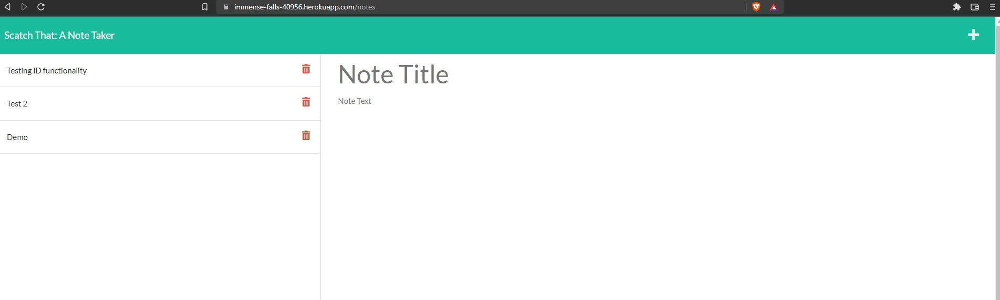

# scratch-that

## Purpose

A note taker built using Express.js.  Allows the user to input a note on the right, which will then save on the server to the left, each individual note having a unqiue ID in the db.json, which will allow the user the ability to delete the item, based upon the said ID in the backend.  

## User Story

AS A small business owner
I WANT to be able to write and save notes
SO THAT I can organize my thoughts and keep track of tasks I need to complete

## Accepted Criteria

GIVEN a note-taking application
WHEN I open the Note Taker
THEN I am presented with a landing page with a link to a notes page
WHEN I click on the link to the notes page
THEN I am presented with a page with existing notes listed in the left-hand column, plus empty fields to enter a new note title and the note’s text in the right-hand column
WHEN I enter a new note title and the note’s text
THEN a Save icon appears in the navigation at the top of the page
WHEN I click on the Save icon
THEN the new note I have entered is saved and appears in the left-hand column with the other existing notes
WHEN I click on an existing note in the list in the left-hand column
THEN that note appears in the right-hand column
WHEN I click on the Write icon in the navigation at the top of the page
THEN I am presented with empty fields to enter a new note title and the note’s text in the right-hand column

## Built With
* HTML
* CSS
* JS
* Node.js
* Express.js

## Images/Demo

## Demo

## Deployed Website

Github : https://jamesbmahoney.github.io/weather-it-be/

Heroku : https://immense-falls-40956.herokuapp.com/